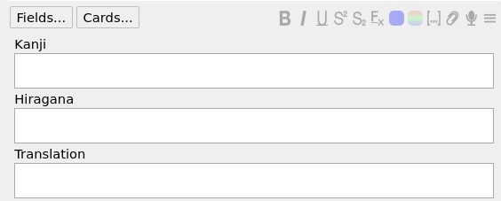
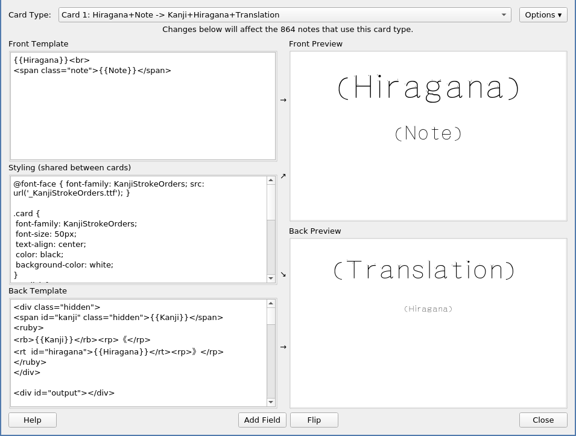
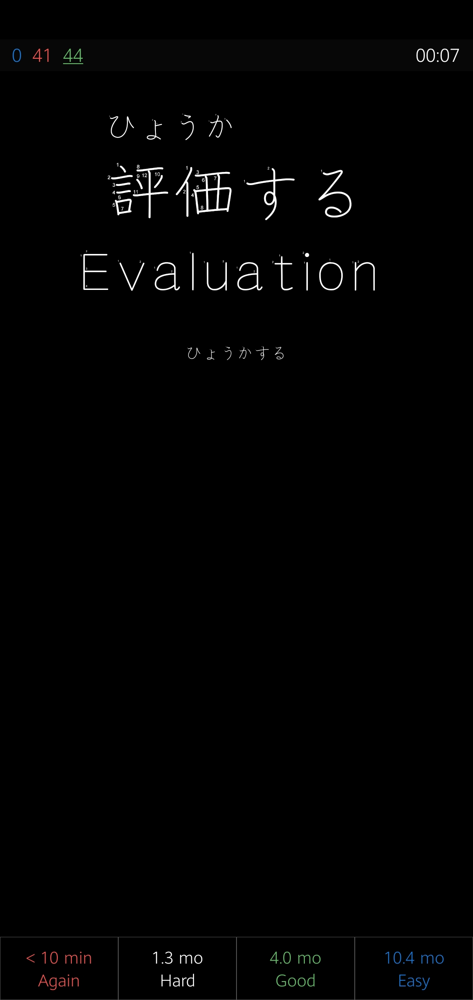

# Automatic Furigana for Anki

This script automatically generates furigana for cards with hiragana reading and it's formal way of writing (kanji, kanji+okurigana, hiragana only). This was made just for my personal usage therefore this contain bugs and unreadable code (I basically wrote this one afternoon and already forgot how it works). If you are willing to fix anything, don't be afraid to submit changes.

## How to setup 

You are required to have following three fields in your deck:

- Kanji

  - Words with its' correct writing (eg. 浅い)

- Hiragana

  - Words with its' correct pronunciation in hiragana (eg. あさい)

- Translation

  - Words with its' translations (eg. shallow)

  (I have addition Note field in my deck)

  ### Setting up the script

  You can find `answer.html` file in this repository. This has to be copied to the card type template into `Back Template`.

  Next, you have to do the same with `card.css` and put it into `Styling`.

  

## Images

